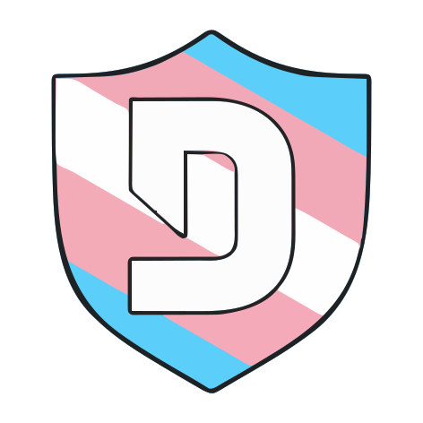

# Disblock Origin Lite

A fork of the ad-blocker "Theme" for Discord that hides all Nitro and "boost" upsells, built for people who still want to use features of Discord.


## Installation

Use your favorite client mod (such as Vencord) to add the theme. You can use this URL, which mirrors the files on the repo:
```
https://raw.githubusercontent.com/WildFyr16/Disblock-Origin-Lite/main/DisblockOrigin.theme.css
```


> [!NOTE]
> There are certain optional features at the end of the CSS you can change by uncommenting them. I am exploring ways to make these more accessible without having to change the CSS, but well here we are for now.


To see whether Disblock Origin Lite is properly installed, check for the logo at the bottom of the settings sidebar next to Discord's social logos, you should see a mauve Disblock Origin Lite logo to let you know it's working.

# What does this change over Disblock Origin?

Disblock Origin is a nice idea, but it removes way to much. Like the gif panel, sitckers, and even profile effects. When all it needed to do was remvoe the Nitro upsells.
For people who already have Nitro, you will loose a lot of features of the app, and nitro.
Not to mention that this theme completly hid the billing section, server boost section, and more from the settings pannel making it very hard to manager your current subscription.
I added back a lot of this core fuctionality while still hading the upsells, also talking to friends I also kept the Discord shop, you can still find it at the top of the Direct Messages tab, but all the upsells in the profile editor and settings for it are gone.
Profile effects are still visable on each users profile, the gift nitro button is gone from the text bar (You can visit User Settings>Nitro>Gift Nitro to access it still), and a few other chagnes.
Basically this is for people who still want the core features of Discord without all the Nitro upsells.
